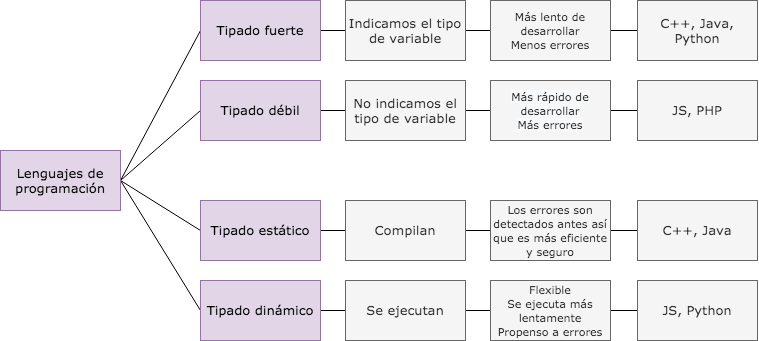

# Clase 10

## Lenguajes de programación

**Paradigmas de programación**

Un paradigma es una forma de pensar bajo un modelo.

- Programación imperativa

    - **Paradigma estructurado** -> Una instrucción a la vez.

    - **Paradigma de programación orientado a objetos** -> El código se agrupa para representar entidades, se crean abstracciones.

- Pogramación declarativa

    - **Paradigma funcional** -> Se basa en las funciones matemáticas.

    - **Paradigma lógico** -> En lugar de desarrollar pasos e instrucciones, infiere mediante reglas lógicas.

- **Paradigma de programación con lenguaje específico de dominio** -> Tratan de resolver problemáticas superespecíficas.

- **Multiparadigma** -> JS, se pueden usar varios paradigmas.

