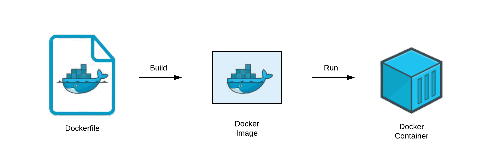

# Clase 11

## Máquinas virtuales

Es un software capaz de contener en su interior un SO.
Permiten probar otros SO, ejecutar programas antiguos, ofrecen un entorno de seguridad.

Existen dos tipos de máquinas virtuales, las de **sistemas** (emulan una computadora completa) y las de **procesos** (emula solo un proceso en concreto, puede ser de utilidad al desarrollar aplicaciones).

El lugar dónde la máquina virtual es creada se llama hypervisor.

**Hypervisor** -> Es una capa de software que se instala sobre la parte física de la computadora y asigna parte de la memoria, CPU etc.

El hypervisor de tipo 1 (como VmWare y Hyper-V) es conocido como "bare-metal" o nativo. Las máquinas virtuales en él tienen acceso directo al hardware, son independientes. Tienen una mayor escalabilidad.
Son más rápidos y seguros.

El hypervisor de tipo 2 (como VmWorkstation o VirtualBox) es conocido como "hosted". Su estabilidad y rendimiento son menores, ya que la carga es soportada por el sistema operativo. Un problema en una máquina puede afectar a otra.
Es más lento.

## Contenedores

Es un concepto de empaquetación de software que incluye la aplicación y sus dependencias. No requieren de un hypervisor.

Ventajas:

- Ahorran recursos físicos

- Poder desplegar varias aplicaciones en un mismo entorno físico

- Fiabilidad de las imágenes ya que no pueden ser modificadas una vez creadas

- Aplicaciones libres de ejecutarse en cualquier entorno

- Una app puede trabajar con uno o más contenedores al mismo tiempo y viceversa

Para implementar un contenedor hay que crear una imagen base del software.

- docker build -> crea una imagen a partir de un Dockerfile.

- docker run -> ejecuta la imagen (crea el contenedor). 

- docker pull -> descarga una imagen o un repositorio del servidor de registros Docker.

Dentro de una VM puede haber contenedores.

**Administración de contenedores || Orquestadores**

Ayudan en la administración y automatización de los contenedores y de los servidores en dónde estos corren.
Estos alertan cuando algún contenedor falla, y puede desviar las peticiones hacia otro contenedor.
