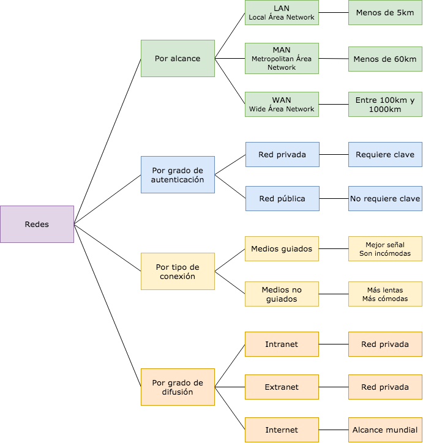
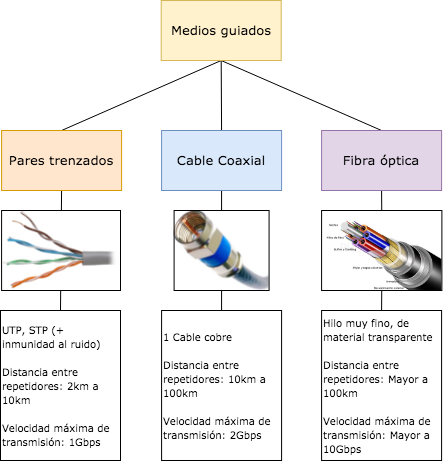
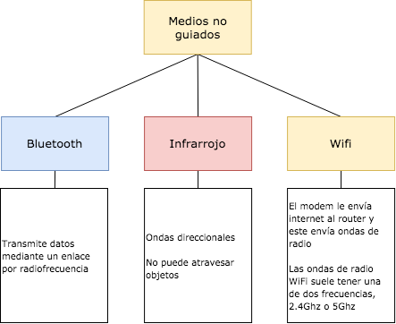

# Clase 12

## Redes

Son un conjunto de dispositivos informáticos conectados entre si, que envían y reciben datos.

### Medios de transmisión

El medio de transmisión constituye el soporte físico a través del cual el emisor y receptor pueden comunicarse en un sistema de transmisión de datos.

#### Medios guiados

Están constituidos por cables que se encargan de la conducción de las señales desde un extremo a otro.

#### Medios no guiados

La transmisión y la recepción de información se lleva a cabo por antenas. Estas irradian **energía electromagnética**.

