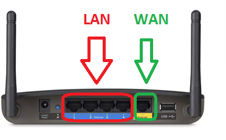

# Clase 12

## Redes

Son un conjunto de dispositivos informáticos conectados entre si, que envían y reciben datos.

### Medios de transmisión

El medio de transmisión constituye el soporte físico a través del cual el emisor y receptor pueden comunicarse en un sistema de transmisión de datos.

#### Medios guiados

Están constituidos por cables que se encargan de la conducción de las señales desde un extremo a otro.

#### Medios no guiados

La transmisión y la recepción de información se lleva a cabo por antenas. Estas irradian **energía electromagnética**.

#### Caracteristicas de una **red de datos**

- Velocidad -> (subida, bajada), se mide generalmente en megabits por segundo.

- Seguridad

- Confiabilidad

- Escalabilidad

- Disponibilidad

**Paquete** -> Son los bloques en los que se divide la información por al red.

**Ping** -> Es el tiempo en el que demora un paquete de datos en ser enviado de un dispositivo a otro, se mide en milisegundos.

#### Nuestra red

Las compañías de internet proveen un router con modem integrado y capaz de transmitir datos por cable y WiFi. 

En el caso de que el router que tenemos no pueda compartir WiFi, hay que conseguir un punto de acceso.

El lugar ideal para el router es lo más cerca al centro de la casa.

Cables de red -> UTP 5E o 6, con dos fichas RJ45 (ethernet) en sus extremos.

**PLC** -> Extensores de red WiFi.

De afuera viene un cable de la red WAN que va conectado a nuestro router.

Siempre que nos conectamos a una red, el router nos identifica para reconocernos, es decir, administra la red.
El router "posee" (es) una **puerta de enlace**.

**Gateway || Puerta de enlace** -> router, es el equipo que se encarga de salir hacia internet, el que tiene la WAN.