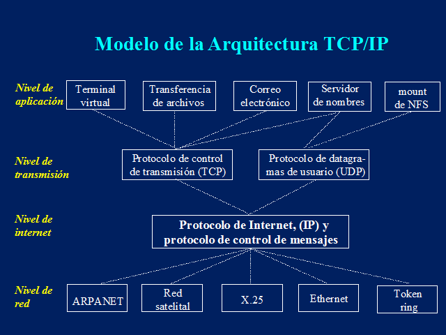
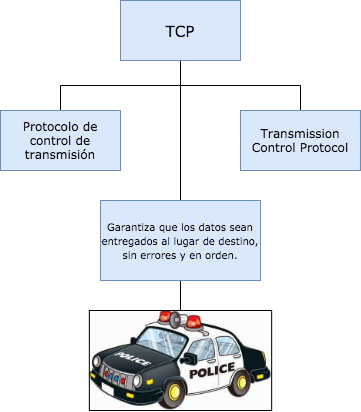
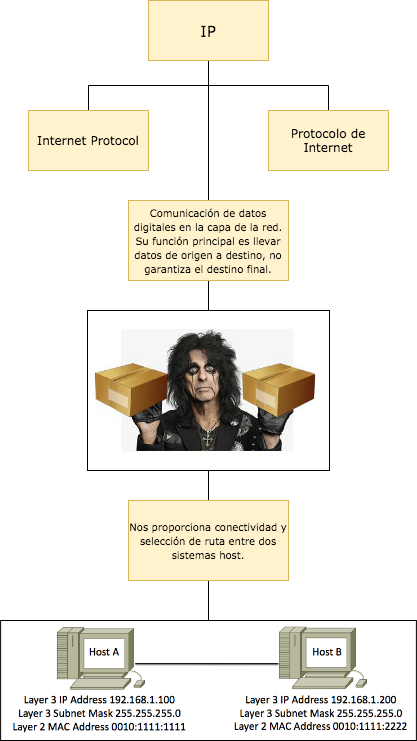

# Clase 13

## Protocolos

### TCP

[TCP da soporte a muchas de las aplicaciones más populares de Internet (navegadores, intercambio de ficheros, clientes FTP, etc.) y protocolos de aplicación HTTP, SMTP, SSH y FTP.]

### IP

Los datos se transfieren mediante paquetes conmutados.
Este protocolo se encargará de buscar el mejor método de enrutamiento, no garantiza alcanzar el destino final.

#### DHCP -> Dynamic Host Configuration Protocol -> Protocolo de configuración dinámica de hosts

El encargado de asignar las direcciones IP.

[Es un protocolo de red de tipo cliente/servidor mediante el cual un servidor DHCP asigna dinámicamente una dirección IP y otros parámetros de configuración de red a cada dispositivo en una red para que puedan comunicarse con otras redes IP. Este servidor posee una lista de direcciones IP dinámicas y las va asignando a los clientes conforme estas van quedando libres.]

#### HTTP -> Hypertext Transfer Protocol -> Protocolo de transferencia de hypertexto

Orientado a transacciones, sigue el esquema petición-respuesta entre un cliente y un servidor.
Es algo inseguro.

[Permite las transferencias de información a través de archivos (XHML, HTML . . .) en la World Wide Web.]

#### DNS -> Domain Name System -> Sistema de nombres de dominio

Su función es traducir los nombres de los domunnios "youtuve.com" en identificadores binarios.

#### FTP ->  -> Protocolo de transferencia de hypertexto